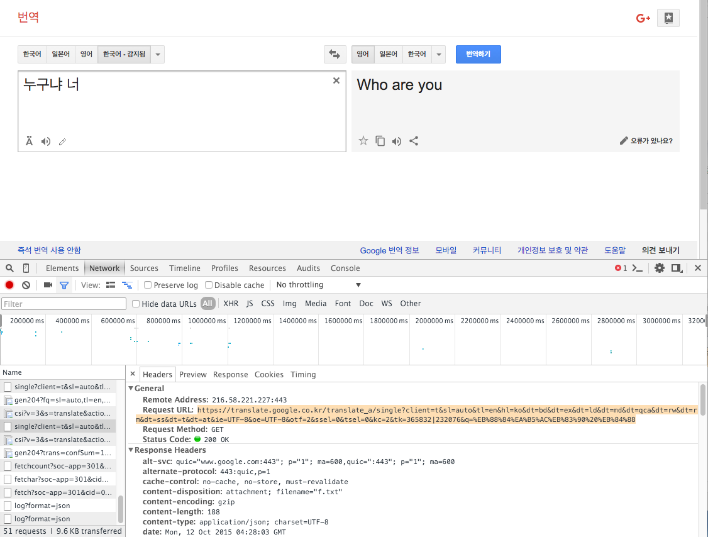

#번역기 만들기


###1. 번역시키는 요청 (Request)



구글 번역 사이트에서 번역을 시키고 요청되는 request 를 보니 위 그림과 같았다.

**Request** : https://translate.google.co.kr/translate_a/single?client=t&sl=auto&tl=en&hl=ko&dt=bd&dt=ex&dt=ld&dt=md&dt=qca&dt=rw&dt=rm&dt=ss&dt=t&dt=at&ie=UTF-8&oe=UTF-8&otf=2&ssel=0&tsel=0&kc=2&tk=365832|232076&q=%EB%88%84%EA%B5%AC%EB%83%90%20%EB%84%88


~~GET 요청이 된다. 파라미터 중에서 다음 항목들이 언어설정과 요청되는 텍스트를 전달하는 것 처럼 보인다.~~
~~(다른 파라미터는 뭔지 모르겠고)~~

~~1. **&tl=en**~~
~~2. **&hl=ko**~~
~~3. **&q=%EB%88%84%EA%B5%AC%EB%83%90%20%EB%84%88**~~

시간이 얼마 지난 후에 다시 시도하면 403 에러가 난다. 이렇게 요청하면 안되나 보다.
[한 블로그](https://ctrlq.org/code/19909-google-translate-api) 를 통해서 Chrome의 Translate Extension 이 Request 하는 URI 를 알았다.

https://translate.googleapis.com/translate_a/single?client=gtx

1. **&sl=en** : source language
2. **&tl=fr** : target language
3. **&dt=t&q=Hello+World** : query text


###2. 처리 결과 (Response)

브라우저에서 위 링크를 연결하니까 txt 파일이 하나 다운로드 된다. 그 내용은 이렇다.
```
[[["Who are you","누구냐 너",,,0],[,,,"nugunya neo"]],,"ko",,,[["누구냐",1,[["Who are",966,true,false],["Who",26,true,false],["Who is",6,true,false],["Who art",0,true,false]],[[0,3]],"누구냐 너",0,2],["너",2,[["you",771,true,false],["too",0,true,false]],[[4,5]],,2,3]],0.038472954,,[["ko"],,[0.038472954]]]
```
이거 뭐야? JSON도 아니고..
내용을 보니, 첫번째 문자열 "..." 에서 원하는 문구가 모두 있다. 이 부분만 떼도록 해보자.
첫번쩨 " 를 찾고, 두번째 " 를 찾아서 그 사이의 문자만 찾아낸다.

```Java
    private String parse(String source) {
		int index = source.indexOf('\"');
		int index2 = source.indexOf('\"', index + 1);
		String parsed = source.substring(index + 1, index2);
		return parsed;
	}
```

###3. 결과물

**실행결과**


interaction
```
<< 안녕하세요
>> Bonjour
<< 누구냐 넌
>> qui êtes-vous
<< quit
```

문자를 입력 받아서 구글 번역 사이트에 요청해서 결과를 받아오는 실행 결과다.
입력은 한국어. 출력은 프랑스어로 해봤다.

###4. 활용1 (AndroidStringTranslator)

안드로이드에서 사용되는 string.xml 을 변역한 결과로 생성하도록 한다.

**Source:** string.xml
```
<?xml version="1.0" encoding="utf-8"?>
<resources>
    <string name="title">My Application</string>
    <string name="hello_world">Hello World!</string>
</resources>
```

**Output:** string-fr.xml
```
<?xml version="1.0" encoding="utf-8" standalone="no"?>
<resources>
    <string name="title">Mon application</string>
    <string name="hello_world">Bonjour le monde!</string>
</resources>
```

DOM Parser 를 사용하여 string.xml 을 읽고 문자열을 번역기를 통해 얻은 결과로 치환하여 파일로 재 저장한다.

###5. 활용2 (iOSStringTranslator)

XCode 에서 localization 에 사용되는 xliff 를 번역한 결과로 생성하도록 한다.
*XCode 프로젝트를 선택하고 Editor > Export For Localization 을 선택하면 xliff 파일을 얻을 수 있다. 
번역한 후에 Import For Localization 을 선택해서 번역본을 적용할 수 있다.*

**Source:** string.xliff
```xml
<?xml version="1.0" encoding="UTF-8" standalone="no"?>
<!-- ...(생략)... -->
<body>
  <trans-unit id="L0B-Ka-xwb.text">
    <source>Hello World</source>
    <target>Hello World</target>
    <note>Class = "UILabel"; text = "Hello World"; ObjectID = "L0B-Ka-xwb";</note>
  </trans-unit>
</body>
<!-- ...(생략)... -->
```

**Source:** string-fr.xliff
```xml
<?xml version="1.0" encoding="UTF-8" standalone="no"?>
<!-- ...(생략)... -->
<body>
  <trans-unit id="L0B-Ka-xwb.text">
    <source>Hello World</source>
    <target>Bonjour le monde</target>
    <note>Class = "UILabel"; text = "Hello World"; ObjectID = "L0B-Ka-xwb";</note>
  </trans-unit>
</body>
<!-- ...(생략)... -->
```


###4. Reference
- https://translate.google.com/
- http://docs.oracle.com/javase/6/docs/api/java/util/Locale.html
- http://useragentstring.com/index.php
- http://developer.android.com/training/basics/supporting-devices/languages.html
- https://ctrlq.org/code/19909-google-translate-api

